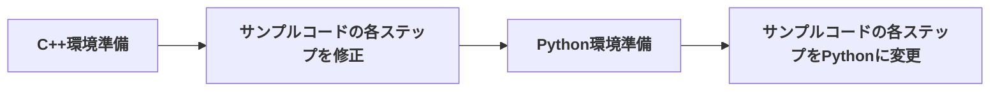

# 「GLFW による OpenGL 入門」(略) のサンプルコードをmacOS, vscode用に修正する

## はじめに

和歌山大学の床井浩平先生がOpenGLの入門書をPDFで公開されています。[^1]

- [「○○くんのために一所懸命書いたものの結局○○くんの卒業に間に合わなかったGLFW による OpenGL 入門」](https://tokoik.github.io/GLFWdraft.pdf)

また、本書のサンプルコードは、GitHub上に公開されています。

- [tokoik/glfw3sample: 「GLFWによるOpenGL入門」のサンプルプログラム](https://github.com/tokoik/glfw3sample)

本書は、GLSL(OpenGL Shading Language)によるプログラマブルシェーダーを使い、CGの理論を実際に手を動かして学ぶ(写経)ことができます。

ありがたいです。ありがとう! 床井先生!

## このプロジェクトの目的

本書では、プログラミング言語として **C++** が採用されています。

残念なことに、私は **C++** がわかりません。
そこで、自分用に、サンプルコードの言語を **Python** に変えていきたいと思います。

ただ、やみくもにサンプルコードの言語を変更しても、ちゃんと動いているかわからないので、
まずは、 **C++** のサンプルをビルドできるようにし、本来の動作を確認できるようにします。

### 手順



## フェーズ0: C++環境準備

### 必要なライブラリのインストール

まず、以下をあらかじめインストールしておきます。

- Xcode command line tool(or xcode) [^2]
- Homebrew [^3]

Homebrew経由で、**GLFW** と **GLEW** ライブラリをインストールします。

```shell
brew install glfw glew
```

### ビルドの仕組み

サンプルコードには、WindowsやLinux、macOS(xcode)用のプロジェクトファイルが含まれています。

ただ、私の開発環境は、**macOS** と **vscode** です。

そこで、サンプルコードの不要なプロジェクトファイルは一旦削除し、[gillesboisson/vscode_opengl_glfw_template: VSCode Project template for glfw opengl development](https://github.com/gillesboisson/vscode_opengl_glfw_template) を参考 [^4] に、 **Makefile** と **vscodeのタスク** を使ってビルドできるようにします。

## フェーズ1： サンプルコードの各ステップを修正

step00〜step40までのビルド環境を修正

- [x] step00
- [x] step01
- [x] step02
- [x] step03
- [x] step04
- [x] step05
- [x] step06
- [x] step07
- [x] step08
- [x] step09
- [x] step10
- [x] step11
- [x] step12
- [x] step13
- [x] step14
- [x] step15
- [x] step16
- [x] step17
- [x] step18
- [x] step19
- [x] step20
- [x] step21
- [x] step22
- [x] step23
- [x] step24
- [x] step25
- [x] step26
- [x] step27
- [x] step28
- [x] step29
- [x] step30
- [x] step31
- [x] step32
- [x] step33
- [x] step34
- [x] step35
- [x] step36
- [x] step37
- [x] step38
- [x] step39
- [x] step40

[^1]: 本書は、絶版になっていますが、[「グラフィックス・アプリ」制作のためのOpenGL入門](https://www.kohgakusha.co.jp/books/detail/978-4-7775-2056-5)としても出版されていたようです。
[^2]: [方法１（おすすめ）：コマンドラインコンパイ... # XCodeのインストール](https://www.isc.meiji.ac.jp/~be00085/ctips/install_xcode/#cmdlinetool)
[^3]: [インストール # macOS（またはLinux）用パッケージマネージャー — Homebrew](https://brew.sh/ja/#install)
[^4]: [kantas-spike/vscode_opengl_glfw_template: VSCode Project template for glfw opengl development](https://github.com/kantas-spike/vscode_opengl_glfw_template?tab=readme-ov-file)
